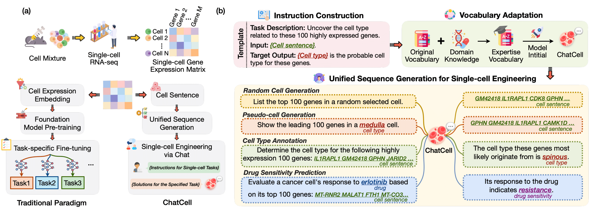

<h1 align="center">  ChatCell  </h1>
<h3 align="center"> Facilitating Single-Cell Analysis with Natural Language </h3>

  📃 <a href="https://arxiv.org/abs/2301.11259" target="_blank">Paper</a> • 🤗 <a href="https://huggingface.co/zjunlp/Chatcell-small" target="_blank">Model</a>  • 🔬 <a href="https://huggingface.co/spaces/zjunlp/Chatcell" target="_blank">Space</a>  

<!-- 

 -->

