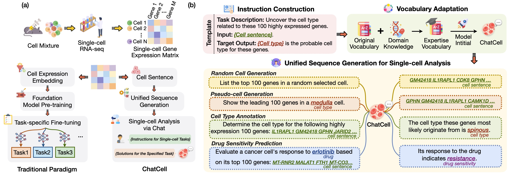
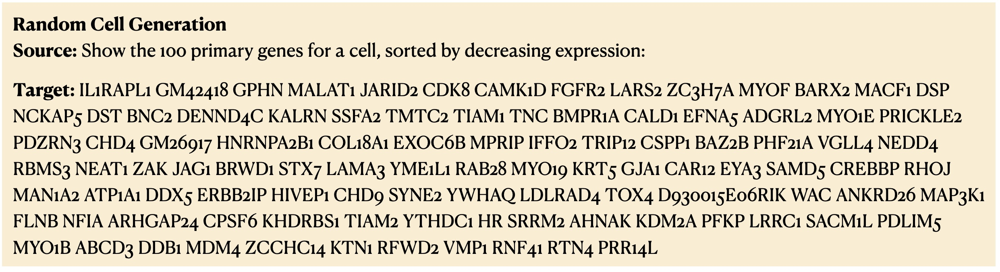
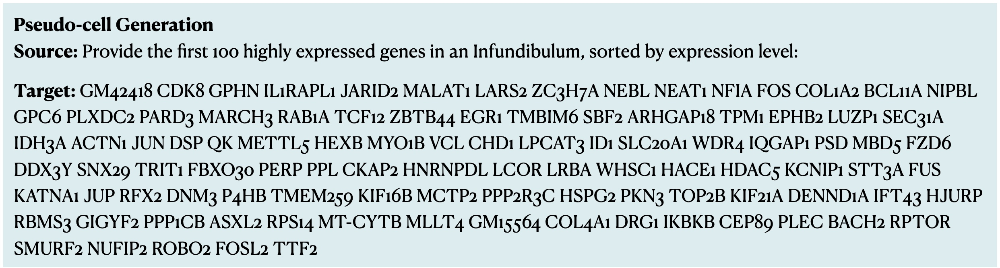
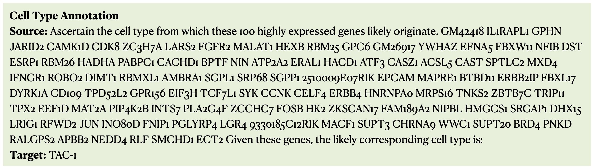
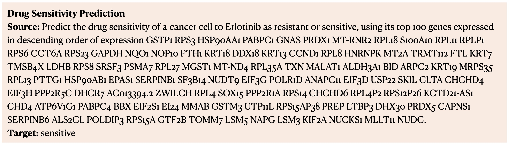

<div align="center">

[](https://github.com/zjunlp/ChatCell/blob/main/LICENSE)
[](https://github.com/zjunlp/ChatCell/blob/main/DATA_LICENSE)


<h2 align="center">   ChatCell: Facilitating Single-Cell Analysis with Natural Language </h2>

<p align="center">
  <a href="https://www.zjukg.org/project/ChatCell">💻 Project Page</a> •
  <a href="https://huggingface.co/datasets/zjunlp/Single-cell-Instructions">🤗 Dataset</a> •
  <a href="https://huggingface.co/spaces/zjunlp/Chatcell">🍎 Demo</a> •
  <a href="#1">🏖️ Overview</a> •
  <a href="#2">🧬 Single-cell Analysis Tasks</a> •
  <a href="#3">🛠️ Quickstart</a> •
  <a href="#4">📝 Cite</a>
</p>


<div align=center></div>
<b>ChatCell</b> allows researchers to input instructions in either natural or single-cell language, thereby facilitating the execution of necessary tasks in single-cell analysis. Black and red texts denote human and single-cell language, respectively.

</div>

## 🆕 News

- **\[Feb 2024\]** We released the model weights and datasets.


## 📌 Table of Contents

- [🏖️ Overview](#1)
- [🧬 Single-cell Analysis Tasks](#2)
- [🛠️ Quickstart](#3)
- [📝 Cite](#4)


---

<h2 id="1">🏖️ Overview</h2>

**Background**
- Single-cell biology examines the intricate functions of the cells, ranging from energy production to genetic information transfer, playing a critical role in unraveling the fundamental principles of life and mechanisms influencing health and disease. 
- The field has witnessed a surge in single-cell RNA sequencing (scRNA-seq) data, driven by advancements in high-throughput sequencing and reduced costs.
- Traditional single-cell foundation models leverage extensive scRNA-seq datasets, applying NLP techniques to analyze gene expression matrices—structured formats that simplify scRNA-seq data into computationally tractable representations—during pre-training. They are subsequently fine-tuned for distinct single-cell analysis tasks, as shown in Figure (a).

<p align="center">

</p>
<div align="center">
Figure 1:  (a) Comparison of traditional single-cell engineering and <b>ChatCell</b>. (b) Overview of <b>ChatCell</b>.
</div>
<br>
We present <b>ChatCell</b>, a new paradigm that leverages natural language to make single-cell analysis more accessible and intuitive.

- Initially, we convert scRNA-seq data into a single-cell language that LLMs can readily interpret.
- Subsequently, we employ templates to integrate this single-cell language with task descriptions and target outcomes, creating comprehensive single-cell instructions.
- To improve the LLM's expertise in the single-cell domain,  we conduct vocabulary adaptation, enriching the model with a specialized single-cell lexicon.
- Following this, we utilize unified sequence generation to empower the model to adeptly execute a range of single-cell tasks.


<h2 id="2">🧬 Single-cell Analysis Tasks</h2>

We concentrate on the following single-cell tasks:

- <b>Random Cell Sentence Generation.</b>
Random cell sentence generation challenges the model to create cell sentences devoid of predefined biological conditions or constraints. This task aims to evaluate the model's ability to generate valid and contextually appropriate cell sentences, potentially simulating natural variations in cellular behavior. 

<p align="center">

</p>


- <b>Pseudo-cell Generation.</b>
Pseudo-cell generation focuses on generating gene sequences tailored to specific cell type labels. This task is vital for unraveling gene expression and regulation across different cell types, offering insights for medical research and disease studies, particularly in the context of diseased cell types.


<p align="center">

</p>

- <b>Cell Type Annotation.</b>
For cell type annotation, the model is tasked with precisely classifying cells into their respective types based on gene expression patterns encapsulated in cell sentences. This task is fundamental for understanding cellular functions and interactions within tissues and organs, playing a crucial role in developmental biology and regenerative medicine.

<p align="center">

</p>

- <b>Drug Sensitivity Prediction.</b>
The drug sensitivity prediction task aims to predict the response of different cells to various drugs. It is pivotal in designing effective, personalized treatment plans and contributes significantly to drug development, especially in optimizing drug efficacy and safety.


<p align="center">

</p>

<h2 id="3">🛠️ Quickstart</h2>

- **📚 Prepare the data**

**Step1:**

**Step2:**

- **🔨 Train**

- **⌨️ Generate**

- **🔍 Evaluate**


<h2 id="4">📝 Cite</h2>

If you use our repository, please cite the following related paper:
```
@article{fang2024chatcell,
  title={ChatCell: Facilitating Single-Cell Analysis with Natural Language},
  author={Fang, Yin and Liu, Kangwei and Zhang, Ningyu and Deng, Xinle and Yang, Penghui and Chen, Zhuo and Tang, Xiangru and Gerstein, Mark and Fan, Xiaohui and Chen, Huajun},
  journal={arXiv preprint arXiv:2306.08018},
  year={2024},
}
```


